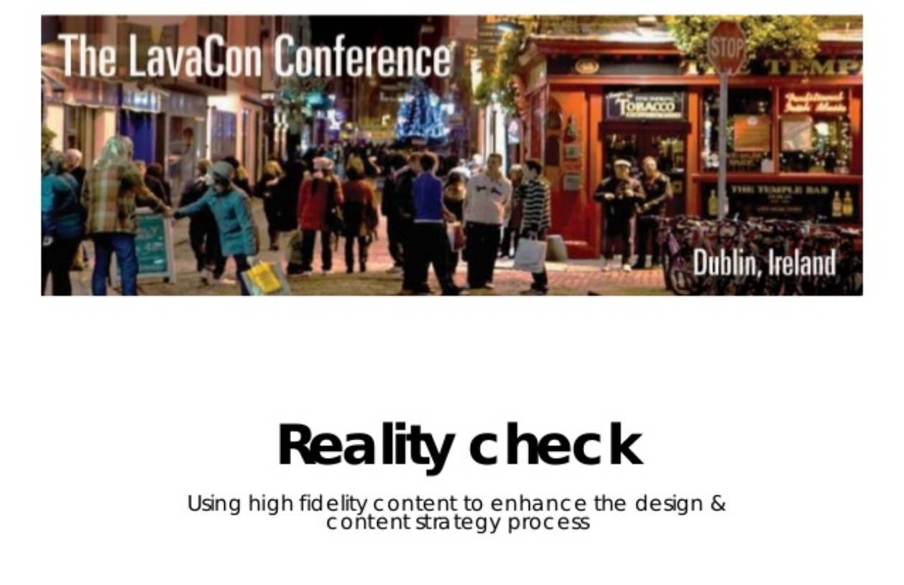

# Introduction 

---

## Zielpublikum und Methode

Zeigt, dass ihr Probleme von Unternehmen mit Inhalten lösen könnt! 

# Related literature and theoretical focus

## Selbständiger Literaturbericht

- Wie wurde die Literatur gefunden?
- Warum wurde gerade diese Literatur ausgewählt?
- Möglichst wenig "graue Literatur" wie Marketing-Blogposts, Firmen-Material usw.
- Titel müssen in Zotero gespeichert sein

## Theoretischer Fokus

- Warum ist gerade dieses Problem interessant/relevant?
- Wo ist die Lösung auf andere Probleme/Situationen übertragbar?

---

"Theorieteil": So spezifisch wie möglich. Bitte nicht allgemeines Wissen über Content-Strategie wiederholen, sondern für das Projekt relevante Entwicklungen erläutern.

# Best practices 

---

- Präsentation ähnlicher Probleme und/oder Lösungen
- Darstellung der Besonderheiten des eigenen Projekts

# Presentation of the project or case study to be covered 

## Beschreibung des Businessproblems

- Das Businessproblem soll durch eine Contentstrategie gelöst werden
- Auch nichtwirtschaftliche Probleme können Business-Probleme sein
- Die Lösung besteht in anderen Inhalten oder in einem anderen Content Lifecycle

## Business Requirements Matrix

> Provide a business requirements matrix, or provide metrics in the form of figures or percentages, where possible.

---

Beispiel für eine Business Requirements Matrix: [Content Mines – Medium](https://medium.com/content-mines/content-strategie-101-2-ziele-to-dos-c8dbb0b09263)

--- 

---

> The Strategic Alignment Summary ... helps get project stakeholders aligned on why you’re doing the project and what it will help your organization achieve. It also serves as a guidebook for project members to ensure that the resulting strategy and recommendations are addressing the right business goals, user needs, challenges, and opportunities.

Casey 2015

---

> This document sets the stage for effective content strategy recommendations that will ensure your web content is useful, usable, purposeful, and profitable. Its purpose is to align your stakeholders on the following:  Business goals and content objectives  Challenges or opportunities your core content strategy and related recommendations must address

Casey 2015

## Business Model Canvas

---

> Gather all the inputs from the assess phase to determine what you need to do for the future. This phase frames the project by defining what you need to do with content. ... If you understand project management principles, you will be able to produce a definitive scope, business requirements, and a mid-level project plan from this phase in preparation for design activities.

Nichols 2015

---

> Work with a business analyst to define the business rules and logic related to each content element. The business analyst efforts capture the business requirements in a functional specification; the content model should capture content-specific rules. The content strategist’s work does not replace a business-requirements matrix, detailed use cases, or functional specifications...

Nichols 2015

# Method

## Zielgruppen/User Nutzen

> ... Gerry McGovern’s Top Tasks Analysis methodology: To use the core model, you need:  Business objectives: Prioritized, measurable objectives and sub-objectives. What does the organization want to achieve?  User tasks: Actual, researched, prioritized user tasks. What is it that people want to get done? 

Casey 2015

## Ist-Zustand und Soll Zustand

> Design the future-state experience... this phase includes many activities. Think of this phase as designing the necessary future-state experience, such as what content and information go on a website or what content is required for a user guide that accompanies a new product.

Nichols 2015

## Zwingende Anforderungen an das Projekt

- Success from the business perspective – specific KPIs or success measures
- Success from the perspective of a content producer/content manager
- Success from a technology perspective
- Success from a change management perspective
- Success from the user/customer perspective
- Success from the brand perspective

## Kennzahlen und Metriken

- Kennzahlen zeigen, dass das Business-Problem gelöst ist
- Kennzahlen ergeben sich aus Teilzielen

# Implementing the strategy

## Implementation als Kern der Masterarbeit

> This chapter is the heart of the thesis. The objective of this section is to present your project with thought and clarity. Discuss your project work, the reasons for various business and content decisions, any methods or decisions adopted, and so on. 

---

> Discuss your implementation method, deliverables, and discuss your results. This is your opportunity to show your analytical skills and business acumen in the context of applying a content strategy to solve a business problem and further business objectives.

---

Credits: Lisa Moore

## Strategie verbindet unterschiedliche Bereiche

- Strategie ist der Weg vom Ist- zum Sollzustand
- Was ist bei diesem spezifischen Projekt erfolgsrelevant?
- Gibt es Show Stopper ?

## Zentrale Themen

Zu jeder Content-Strategie gehört ein Konzept für
- User Requirements
- Branding/Kernbotschaften
- Inhaltsmodell
- Technik (Plattformen, Content Management)
- Governance

## Strategie schliesst andere Optionen aus?

- Welche Optionen gibt es?
- Warum werden sie verworfen?

## Empfehlenswert

Bailie, R. A., & Urbina, N. (2012). Content Strategy: Connecting the Dots Between Business, Brand, and Benefits. 

Casey, M. (2015). The Content Strategy Toolkit.

Content Strategy Alliance (Hrsg.). (2015). Content Strategy Alliance Tools And Templates. http://contentstrategyalliance.com/wp-content/uploads/2015/08/CSA-Handbook.pdf

Nichols, K. (2015). Enterprise Content Strategy: A Project Guide. 
